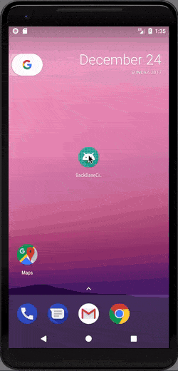
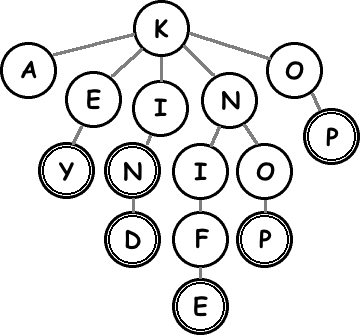

# BackBase Cities App Assignment

### Why Trie ?

Trie is a type of tree data structure, it is normally used to store characters / strings / dictionary ...Etc :

* Each node represents a character
* Each node contains references to next nodes
* Each path from the root to the end represents a word or a part of a word

Searching data in a trie is faster than other data structure (Array, HashTable ..Etc) : O(m) time (where m is the length of a search string).